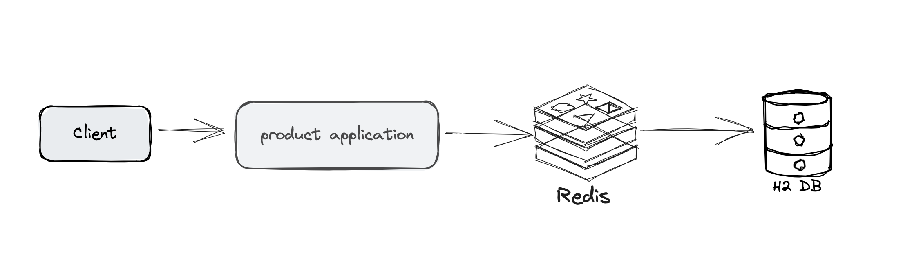

# Spring Boot 3 Redis + Spring Cache Annotation

This is a demo project of Spring Boot 3 with Spring Cache.

## Architecture


## Tech Stack
+ Spring Boot 3
+ Spring Cache
+ Spring Data JPA
+ H2 DB
+ Redis
+ Docker
+ Maven
+ Postman

## How to Deploy this Project

**Git clone this repo**

```
git clone https://github.com/KevinChung616/spring-cache-redis.git
```

**Run Maven command**
```
mvn clean install
```

**Spin up Redis in Docker**
```
docker run --name redis-server -p 6379:6379 -d redis
```

**Start SpringBoot Application in IntelliJ**

CLick Run button in the main class.

**Test in Postman by Importing test json file**

```json
{
	"info": {
		"_postman_id": "cad6cdde-f16f-4de9-a282-137b872e51e0",
		"name": "spring-cache-annotation-redis",
		"schema": "https://schema.getpostman.com/json/collection/v2.1.0/collection.json",
		"_exporter_id": "27355775"
	},
	"item": [
		{
			"name": "batch-save",
			"request": {
				"method": "POST",
				"header": [],
				"body": {
					"mode": "raw",
					"raw": "{\n    \"id\": 8,\n    \"name\": \"Product Iphone\",\n    \"quantity\": 100,\n    \"company\": \"Company X\"\n}",
					"options": {
						"raw": {
							"language": "json"
						}
					}
				},
				"url": {
					"raw": "http://localhost:8080/products",
					"protocol": "http",
					"host": [
						"localhost"
					],
					"port": "8080",
					"path": [
						"products"
					]
				}
			},
			"response": []
		},
		{
			"name": "save-product",
			"request": {
				"method": "POST",
				"header": [],
				"body": {
					"mode": "raw",
					"raw": "[\n  {\n    \"id\": 1,\n    \"name\": \"Product A\",\n    \"quantity\": 100,\n    \"company\": \"Company X\"\n  },\n  {\n    \"id\": 2,\n    \"name\": \"Product B\",\n    \"quantity\": 200,\n    \"company\": \"Company Y\"\n  },\n  {\n    \"id\": 3,\n    \"name\": \"Product C\",\n    \"quantity\": 150,\n    \"company\": \"Company Z\"\n  },\n  {\n    \"id\": 4,\n    \"name\": \"Product D\",\n    \"quantity\": 250,\n    \"company\": \"Company W\"\n  },\n  {\n    \"id\": 5,\n    \"name\": \"Product E\",\n    \"quantity\": 300,\n    \"company\": \"Company V\"\n  }\n]\n",
					"options": {
						"raw": {
							"language": "json"
						}
					}
				},
				"url": {
					"raw": "http://localhost:8080/products/batch-save",
					"protocol": "http",
					"host": [
						"localhost"
					],
					"port": "8080",
					"path": [
						"products",
						"batch-save"
					]
				}
			},
			"response": []
		},
		{
			"name": "getById",
			"protocolProfileBehavior": {
				"disableBodyPruning": true
			},
			"request": {
				"method": "GET",
				"header": [],
				"body": {
					"mode": "raw",
					"raw": "",
					"options": {
						"raw": {
							"language": "json"
						}
					}
				},
				"url": {
					"raw": "http://localhost:8080/products/5",
					"protocol": "http",
					"host": [
						"localhost"
					],
					"port": "8080",
					"path": [
						"products",
						"5"
					]
				}
			},
			"response": []
		},
		{
			"name": "listAll",
			"protocolProfileBehavior": {
				"disableBodyPruning": true
			},
			"request": {
				"method": "GET",
				"header": [],
				"body": {
					"mode": "raw",
					"raw": "",
					"options": {
						"raw": {
							"language": "json"
						}
					}
				},
				"url": {
					"raw": "http://localhost:8080/products",
					"protocol": "http",
					"host": [
						"localhost"
					],
					"port": "8080",
					"path": [
						"products"
					]
				}
			},
			"response": []
		}
	]
}
```


## Annotation Guide
`@Cacheable`
+ Purpose: This annotation is used to indicate that the result of invoking a method (or all methods in a class) can be cached. The next time the method is invoked with the same arguments, the cached result is returned, avoiding the need to execute the method again.
+ Attributes:
  + `value`: The name of the cache where the result will be stored.
  + `key`: The key under which the result will be stored. By default, the method parameters are used to compute the key.

```java
@Cacheable(value = "products", key = "#id")
public Product findProductById(Long id) {
    return productRepository.findById(id).orElse(null);
}
```
In this example, the result of findProductById is cached with the key being the product ID. If the method is called again with the same ID, the cached product will be returned.

`@CachePut`

+ Purpose: This annotation is used to update the cache with the method's result. Unlike @Cacheable, @CachePut always executes the method and then updates the cache with the returned result.
+ Attributes:
  + `value`: The name of the cache to be updated.
  + `key`: The key under which the result will be stored. By default, the method parameters are used to compute the key.

```java
@CachePut(value = "products", key = "#product.id")
public Product createProduct(Product product) {
    return productRepository.save(product);
}

```

`@CacheEvict`
+ Purpose: This annotation is used to remove an entry from the cache. This is typically used when the data is updated or deleted, and the cache needs to be cleared to ensure consistency.

+ Attributes:

  + `value`: The name of the cache from which the entry will be removed.
  + `key`: The key of the entry to be removed. If not specified, the method parameters are used to compute the key.
  + `allEntries`: A boolean attribute. If set to true, it indicates that all entries in the cache should be removed.

```java
@CacheEvict(value = "products", key = "#id")
public void deleteProductById(Long id) {
    productRepository.deleteById(id);
}

@CacheEvict(value = "products", allEntries = true)
public List<Product> createProducts(List<Product> products) {
        return productRepository.saveAll(products);
}

```


## Q&A

Q: The difference between `@Cacheable` and `@CachePut` ?
A: `@Cacheable` will skip running the method, whereas `@CachePut` will actually run the method and then put its results in the cache.


Q: Expects `Serializable` but `com.xxx.entity.Product`? 
A: make sure cache entities implements `Serializable`